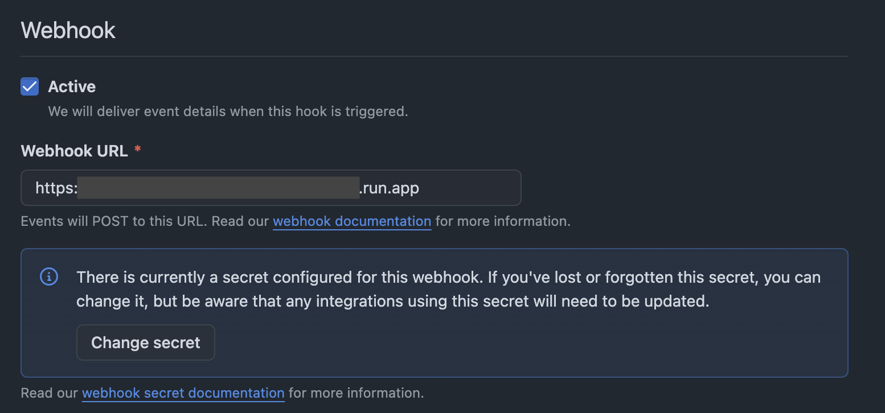

## Prerequisites

To self-host OpenCI, you need to meet the following prerequisites:

- M1 or later Mac
- macOS 14.0 or later

## Initial Setup

To self-host OpenCI, you need to install several tools.

### Tart

Tart is a tool for managing macOS VMs.

<CodeGroup>

  ```bash macOS
  brew install cirruslabs/cli/tart
  ```

</CodeGroup>

### Firebase CLI

OpenCI uses Firebase, so you need to install the Firebase CLI.

<CodeGroup>

  ```bash macOS
  curl -sL https://firebase.tools | bash
  ```

</CodeGroup>

### OpenCI Runner

OpenCI Runner is a CLI for running OpenCI. Dart is required for installation.

<CodeGroup>

  ```bash macOS
  dart pub global activate openci_runner
  ```

  ```bash install Dart
  brew install dart-sdk
  ```

</CodeGroup>

### Download Base Image

OpenCI uses macOS 15.0 as a base image. This will take a very long time.

<CodeGroup>

  ```bash macOS
tart pull ghcr.io/open-ci-io/sequoia:0.0.4
  ```

</CodeGroup>

## Firebase Configuration

OpenCI uses Firebase for the backend, etc. Therefore, Firebase configuration is necessary.

### Create a Firebase Project

Access the [Firebase site](https://console.firebase.google.com/) with any Google account and create a project.

### Firestore Configuration

Firestore is used for registering build jobs. Therefore, access Firestore and perform provisioning.

### Firebase Functions Configuration

OpenCI uses Firebase Functions. Using Firebase Functions requires registration for the Blaze plan (paid). The cost is a few yen per month.

### Firebase Initialization

After creating a Firebase project, specify the project to use.

<CodeGroup>

  ```bash macOS
  firebase use project-id
  ```

</CodeGroup>


### Deploy Firebase Functions

Clone the OpenCI CLI repository.
<CodeGroup>

  ```bash macOS
  gh repo clone open-ci-io/openci
  ```

</CodeGroup>

## GitHub App Configuration

OpenCI uses a GitHub app to retrieve build jobs.

### Create a GitHub App

Access [GitHub app creation](https://github.com/settings/apps/new) and create a GitHub app.

## Secret Configuration

Register the GitHub app secrets used by Firebase Functions in Google Cloud's Secret Manager.

Navigate to `/apps/firebase_functions/functions/`,

#### GITHUB_APP_ID

<CodeGroup>

  ```bash macOS
  firebase functions:secrets:set APP_ID
  ```

</CodeGroup>

#### GITHUB_WEBHOOK_SECRET

This is a "secret random string" used to verify the authenticity of Webhooks sent from GitHub.

Generate a string as follows,

<CodeGroup>

  ```bash macOS
  openssl rand -hex 32
  ```

</CodeGroup>

Set the generated string to `GITHUB_WEBHOOK_SECRET` in Firebase Functions.

<CodeGroup>

  ```bash macOS
  firebase functions:secrets:set GITHUB_WEBHOOK_SECRET
  ```

</CodeGroup>

Then, set this string as the Webhook Secret for the GitHub app.

The Webhook configuration is complete when it looks like the following.



#### GITHUB_PRIVATE_KEY

<CodeGroup>

  ```bash macOS
  firebase functions:secrets:set PRIVATE_KEY
  ```

</CodeGroup>

After setting all the Secrets, deploy the Firebase Functions.

<CodeGroup>

  ```bash macOS
  cd apps/firebase_functions/functions
  firebase deploy --only functions
  ```

</CodeGroup>

Finally, specify the URL of the Firebase Functions' `gitHubAppFunction` as the webhook URL for the GitHub app.

### Create a Firebase Service Account

Create a Firebase service account and place it as apps/openci_runner/firebase_service_account.json.

This completes the preparation for self-hosting OpenCI. Congratulations!